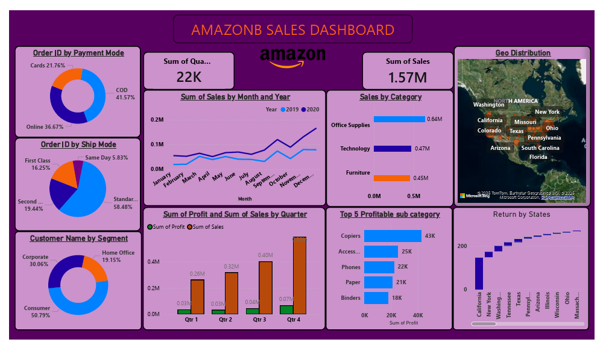

# amazon-sales-dashboard-powerbi
Interactive Amazon Sales Dashboard built using Power BI for business insights and KPI analysis.
# Amazon Sales Dashboard - Power BI Project

## Overview
This project is an interactive Amazon Sales Dashboard built using Power BI to analyze sales performance, customer behavior, profit trends, and regional sales distribution.

## Dashboard Features
- Sales & Profit Analysis
- Customer Segmentation
- Shipping Mode Analysis
- Payment Mode Insights
- Geo Distribution of Sales
- Top Profitable Sub-Categories
- State-wise Return Analysis

## Tools & Technologies
- Power BI
- Data Visualization
- Business Intelligence
- KPI Analysis

## Dashboard Preview

## Project Files
- `.pbix` Power BI source file
- Dashboard PDF
- Dashboard Screenshot

## Key Learnings
- Interactive dashboard creation
- Data storytelling
- KPI visualization
- Business analytics concepts
- Dashboard design principles

## Author
Prajwal C A
